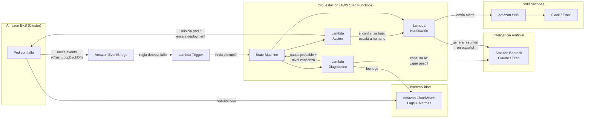
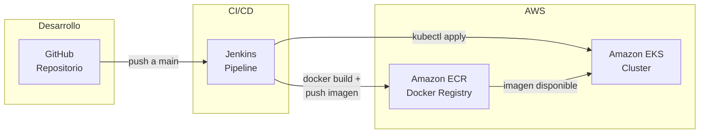

# Diagrama de Arquitectura — Infrastructure Auto-Healing Agent

## Flujo principal: Detección y auto-healing

## Pipeline CI/CD

## Servicios involucrados

| Servicio | Rol en el sistema |
|----------|-------------------|
| Amazon EKS | Cluster donde corren las aplicaciones (pods) |
| Amazon EventBridge | Detecta eventos de fallo en EKS |
| AWS Lambda (x4) | Trigger, Diagnóstico, Acción, Notificación |
| AWS Step Functions | Orquesta el flujo entre los agentes |
| Amazon Bedrock | IA para análisis de logs y generación de reportes |
| Amazon CloudWatch | Almacena logs y métricas |
| Amazon ECR | Registro privado de imágenes Docker |
| Amazon SNS/SES | Envío de notificaciones |
| Jenkins | Pipeline CI/CD automatizado |
| GitHub | Repositorio de código fuente |

## Notas de diseño

- **Multi-agente:** Cada Lambda cumple un rol específico (diagnóstico, acción, notificación), orquestados por Step Functions.
- **Bedrock como cerebro:** Se usa para interpretar logs (diagnóstico) y para generar reportes legibles (notificación).
- **Escalamiento a humano:** Si el agente de diagnóstico tiene baja confianza en su análisis, no actúa automáticamente — escala a un humano via Slack.
- **Principio de mínimo privilegio:** Cada Lambda tiene un IAM role con solo los permisos que necesita (esto se detalla en la tarea 2.3).
